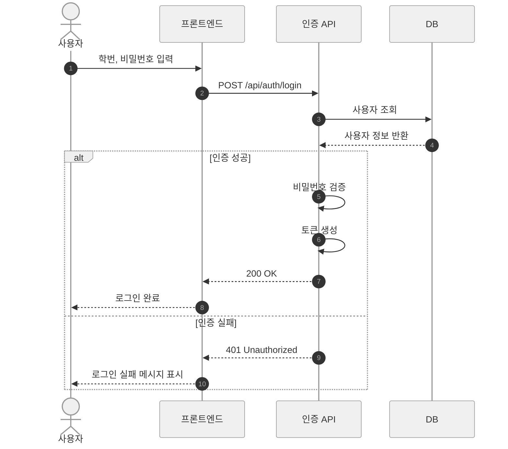
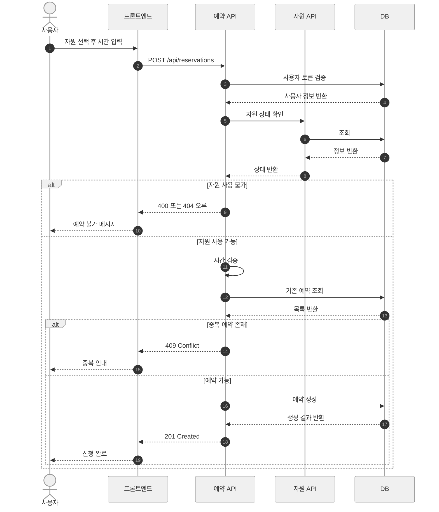
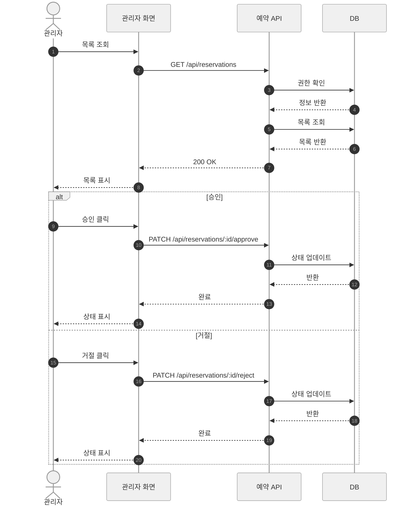

@startuml
title Cloud V-Lab Center - Class Diagram

skinparam classAttributeIconSize 0
skinparam shadowing false

left to right direction

class User {
- id : ObjectId
- name : String
- email : String
- role : String
}

class Knowledge {
- id : ObjectId
- title : String
- content : String
- createdAt : Date
}

class Category {
- id : ObjectId
- name : String
- description : String
}

class Notice {
- id : ObjectId
- title : String
- content : String
- createdAt : Date
}

class Issue {
- id : ObjectId
- title : String
- content : String
- status : String
}

User "1" --> "0..*" Knowledge : creates
Knowledge "0..*" --> "1" Category : belongs to
Category "0..*" --> "0..1" Category : parent

User "1" --> "0..*" Notice : creates
User "1" --> "0..*" Issue : creates
User "0..1" --> "0..*" Issue : resolves

Notice -[hidden]- Category
Issue -[hidden]- Knowledge

@enduml

# 시퀀스 다이어그램 모음

## 목차
1. [로그인 흐름](#1-로그인-흐름)
2. [예약 신청 흐름](#2-예약-신청-흐름)
3. [예약 승인 / 거절 흐름](#3-예약-승인--거절-흐름)

---

## 1. 로그인 흐름

### 흐름 설명

사용자가 학번과 비밀번호를 입력하면 프론트엔드가 `/api/auth/login`으로 요청을 전송합니다.

인증 API는 DB에서 해당 학번의 사용자를 조회한 뒤 두 가지 경우로 분기됩니다.

- **인증 성공 시** — 비밀번호를 검증하고 `accessToken`과 `refreshToken`을 생성해 프론트엔드에 반환합니다.
- **인증 실패 시** — `401 Unauthorized`를 반환하고 사용자에게 실패 메시지를 표시합니다.

---

## 2. 예약 신청 흐름

### 흐름 설명

사용자가 자원을 선택하고 시간과 목적을 입력하면 프론트엔드가 `/api/reservations`로 요청을 전송합니다.

예약 API는 아래 순서로 유효성 검사를 진행합니다.

1. **자원 상태 확인** — 자원이 존재하지 않거나 점검·폐기 상태이면 `400` 또는 `404`를 반환합니다.
2. **운영 시간 확인** — 요청한 시간이 운영 요일(월 ~ 금) 및 운영 시간(09:00~22:00) 범위를 벗어나면 `400`을 반환합니다.
3. **중복 예약 확인** — 동일 자원·동일 시간대에 이미 예약이 존재하면 `409 Conflict`를 반환합니다.

모든 검사를 통과하면 예약이 생성되고 `status: waiting` 상태로 승인 대기에 들어갑니다.

---

## 3. 예약 승인 / 거절 흐름

### 흐름 설명

관리자가 전체 예약 목록을 조회하면 `GET /api/reservations`로 요청이 전송됩니다.
API는 관리자 권한을 확인한 뒤 전체 예약 목록을 반환합니다.

목록 조회 이후 승인과 거절 두 가지 분기로 나뉩니다.

- **승인 시** — `PATCH /api/reservations/:id/approve` 요청으로 예약 `status`가 `waiting → reserved`로 변경됩니다.
- **거절 시** — `PATCH /api/reservations/:id/reject` 요청으로 예약 `status`가 `waiting → cancelled`로 변경되고 거절 사유가 함께 저장됩니다.

