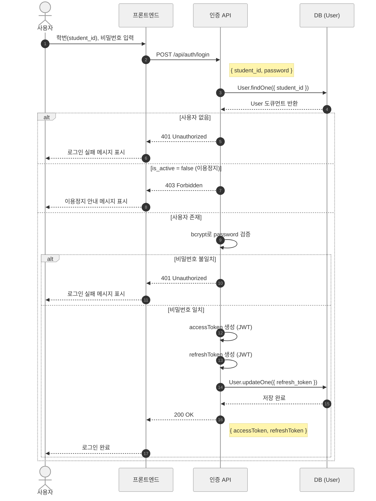
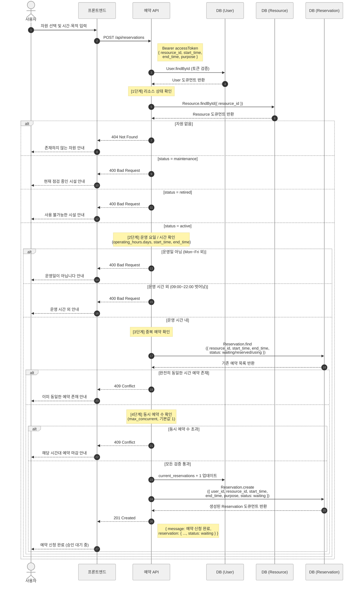
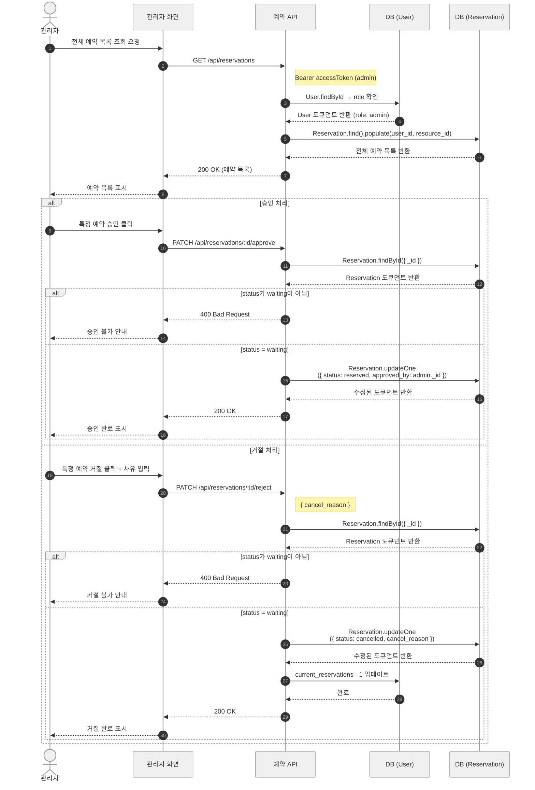

# 시퀀스 다이어그램 모음

## 목차
1. [로그인 흐름](#1-로그인-흐름)
2. [예약 신청 흐름](#2-예약-신청-흐름)
3. [예약 승인 / 거절 흐름](#3-예약-승인--거절-흐름)

---

## 1. 로그인 흐름

[↑ 목차로](#목차)

---

## 2. 예약 신청 흐름

[↑ 목차로](#목차)

---

## 3. 예약 승인 / 거절 흐름

[↑ 목차로](#목차)
